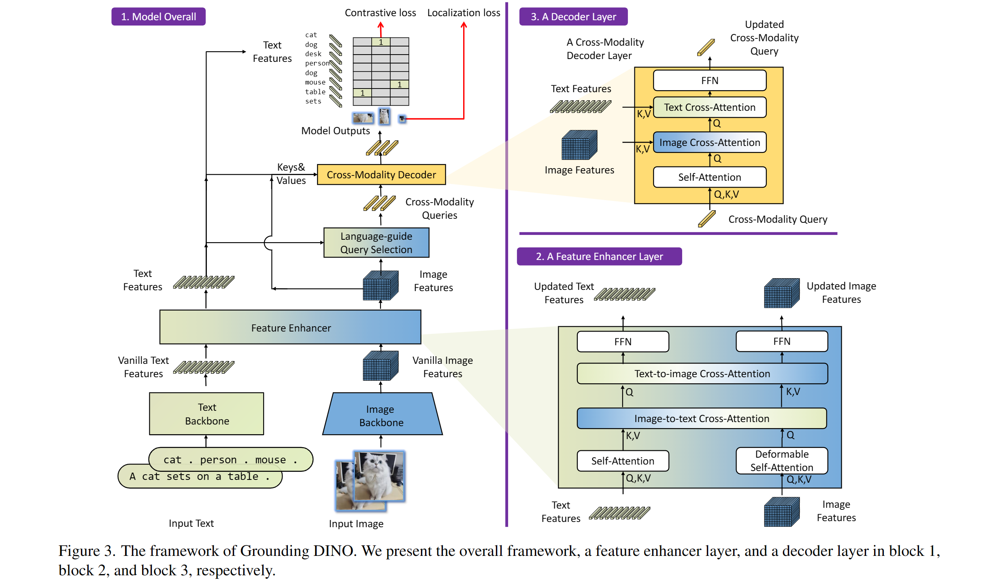

# GDINO + GSAM

Grounding DINO + SAM (ref: https://huggingface.co/docs/transformers/model_doc/grounding-dino)



### Grounding DINO (GDINO)

**Grounding DINO** is an advanced object detection model that extends the capabilities of a closed-set object detector,
DINO (DEtection with INterpolation Optimized), by integrating it with a text encoder. This enables the model to perform
open-set object detection, which means it can detect arbitrary objects based on human inputs such as category names or
referring expressions. The key innovation in GDINO is the effective fusion of language and vision modalities,
accomplished through three main components:

1. **Feature Enhancer**: Enhances the input features using both self-attention and cross-attention mechanisms.
2. **Language-Guided Query Selection**: Selects queries during the detection process using language information.
3. **Cross-Modality Decoder**: Uses cross-attention layers to improve query representations, ensuring better fusion of
   textual and visual information.

GDINO achieves remarkable results on various benchmarks, including COCO, LVIS, ODinW, and RefCOCO/+/g, demonstrating its
ability to generalize to novel object categories and perform well in zero-shot scenarios (e.g., achieving 52.5 AP on
COCO zero-shot transfer without any COCO training data).

### Grounded SAM (GSAM)

**Grounded SAM** is an approach that combines Grounding DINO with the Segment Anything Model (SAM) for text-based mask
generation. SAM is designed to handle segmentation tasks by segmenting objects in images, often referred to as the "
segment anything" model due to its broad applicability. By integrating GDINO with SAM, Grounded SAM leverages the
strengths of both models:

- **GDINO** provides the ability to detect objects based on text descriptions.
- **SAM** performs precise segmentation of these detected objects.

This combination allows users to generate masks for objects specified through natural language, making it a powerful
tool for diverse visual tasks where precise object localization and segmentation based on textual descriptions are
required.

### Example Usage

Here's an example of how to use GDINO for zero-shot object detection:

```python
import requests
import torch
from PIL import Image
from transformers import AutoProcessor, AutoModelForZeroShotObjectDetection

model_id = "IDEA-Research/grounding-dino-tiny"
processor = AutoProcessor.from_pretrained(model_id)
model = AutoModelForZeroShotObjectDetection.from_pretrained(model_id).to('cuda')

image_url = "http://images.cocodataset.org/val2017/000000039769.jpg"
image = Image.open(requests.get(image_url, stream=True).raw)
text = "a cat. a remote control."

inputs = processor(images=image, text=text, return_tensors="pt").to('cuda')
with torch.no_grad():
    outputs = model(**inputs)

results = processor.post_process_grounded_object_detection(
    outputs,
    inputs.input_ids,
    box_threshold=0.4,
    text_threshold=0.3,
    target_sizes=[image.size[::-1]]
)
```

This script sets up the processor and model, processes an image and text pair, and performs object detection,
post-processing the outputs to get the final detection results.

### Combining GDINO + GSAM

According
to
[this notebook](
https://github.com/NielsRogge/Transformers-Tutorials/blob/master/Grounding%20DINO/GroundingDINO_with_Segment_Anything.ipynb
),
you can combine Grounding DINO with the Segment Anything (SAM) model for text-based mask
generation by following these steps:

1. Use Grounding DINO to detect the given set of text labels in the image and obtain bounding boxes for the detected
   objects.
2. Provide the image and the bounding boxes from Grounding DINO to the Segment Anything (SAM) model.
3. The SAM model will generate segmentation masks corresponding to the provided bounding boxes.

The key functions defined in the notebook are:

1. `detect(image, labels, threshold, detector_id)`: This function uses Grounding DINO to detect the given `labels` in
   the `image` and returns a list of `DetectionResult` objects containing the bounding boxes and scores.

2. `segment(image, detection_results, polygon_refinement, segmenter_id)`: This function takes the `image` and
   the `detection_results` from Grounding DINO, and uses the Segment Anything (SAM) model to generate segmentation masks
   for the bounding boxes. It returns the `DetectionResult` objects with the masks added.

3. `grounded_segmentation(image, labels, threshold, polygon_refinement, detector_id, segmenter_id)`: This is the main
   function that combines the above two functions. It first calls `detect` to get the bounding boxes from Grounding
   DINO, and then calls `segment` to generate the masks using SAM. It returns the original image and the list
   of `DetectionResult` objects with masks.


